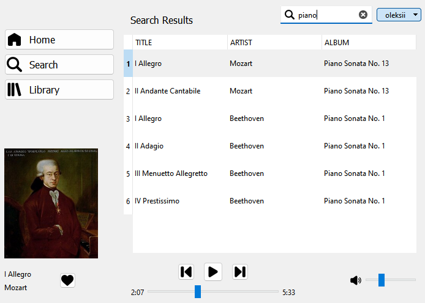

# Music Streaming Service

## Overview
This project is a music streaming service that allows users to listen to their favorite albums and save individual songs to their library.

## Quick Start
1. Run the setup file from the releases page
2. Open the application

## Self-Hosted Installation
To host the server yourself, follow these steps:
1. Clone the repository
```bash
git clone https://github.com/oleksii-nakhod/music.git
```
2. Navigate to the server directory
```bash
cd music/server
```
3. Initialize the database
```bash
mysql> source init_database.sql
```
4. Create the virtual environment.
```bash
python -m venv .venv
```
5. Activate the virtual environment.
- For Windows, use:
```bash
.venv\Scripts\activate
```
- For macOS/Linux, use:
```bash
source .venv/bin/activate
```
6. Install the dependencies
```bash
pip install -r requirements.txt
```
7. Run the server
```bash
python app.py
```
8. Replace the SERVER_URL in the [client config](client/config.h) file with your server URL
9. Run the client

## Acknowledgements
- Design inspired by [Spotify](https://www.spotify.com)
- Icons from [Flaticon](https://www.flaticon.com/authors/freepik)